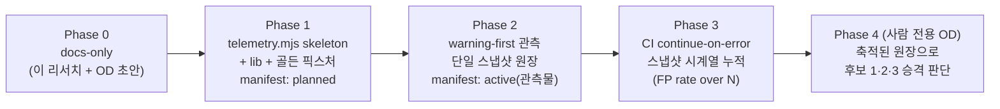

# Telemetry & Promotion-Evidence Harness — frontend-workflow-kit 투입 아이디어 리서치

> 날짜: 2026-07-05 · status: draft(리서치 산출물, 게이트 아님)
>
> 이 문서는 **아무것도 게이트하지 않는 리서치 증거물**이다. 여기 담긴 어떤 제안도 readiness/validate 게이트를 올리거나 내리지 않으며, 실제 도입(adoption)은 언제나 **별도 Open Decision + 사람 승인** 을 거친다. 이 문서 자체가 정본(README/roadmap/package/manifest/policy)을 바꾸지 않는다.

## 한 줄 결론

로드맵의 거의 모든 "다음 구현 후보"(lint-pack 게이트 · Tier2 codegen/route 어댑터 · Interaction Matrix 검사 13)는 하나같이 **"warning-first 로 랜딩됨 · 하드 게이트 승격은 telemetry/adoption 이후 별도 Open Decision"** 에서 멈춰 있는데, 정작 그 telemetry 를 **반복 가능하게 관측하는 표면이 킷에 없다.** 지금 증거는 손으로 만든 일회성 run report([lint-gate-promotion-evidence-001](../../../kit-dev/temp/runs/lint-gate-promotion-evidence-001.md) · [tier2-gate-promotion-evidence-001](../../../kit-dev/temp/runs/tier2-gate-promotion-evidence-001.md))로만 존재하고, 이 리포트들은 **비결정적이며 clean 하게 재현되지도 않았다**(둘 다 `node_modules` 없어서 첫 명령이 실패, tier2 는 "이 byte/sha 는 portable reproduction key 가 아니다" 라고 스스로 명시). 제안: `doctor`/`adoption-probe`/`route-cross-check` 와 **동형(同型)** 인 결정적·읽기전용·warning-first 관측 도구 `workflow:telemetry`(observation-ledger). 승격 OD 가 요구하는 신호(determinism witness, 표면별 drift/false-positive 카운트, adoption fact)를 **멱등한 커밋 산출물**로 모은다. **절대 게이트가 아니다.**

---

## 1. 문제 — 근거 기반

### 1.1 승격은 전부 "telemetry 이후"로 유예돼 있다

로드맵 "다음 구현 후보" 3개 항목이 모두 같은 문장으로 끝난다.

| 후보 | 현재 상태 | 승격 조건(원문) | 근거 |
|---|---|---|---|
| 1. lint-pack | PR-5 warning-first CI smoke (`continue-on-error`) | "observed telemetry/brownfield dogfood 이후 hard gate/required check/`--enforce` 승격 여부를 **별도 Open Decision** 으로 검토" | [roadmap:113](../../../kit-dev/roadmap-current.md) |
| 2. Tier2 codegen/route 어댑터 | warning-first, 서브슬라이스 마감 | OD-11 로 "승격은 실제 도입(adoption) telemetry 전까지 **연기**; 재오픈 트리거 = 실제 도입 후 warning-first telemetry 발생" | [roadmap:115](../../../kit-dev/roadmap-current.md) |
| 3. Interaction Matrix 검사 13 | warning-only 랜딩됨 | "남은 것은 **telemetry 후** 검사 13 의 하드 게이트 승격 여부를 별도 decision PR 에서 검토하는 것뿐" | [roadmap:117](../../../kit-dev/roadmap-current.md) |

즉 로드맵은 telemetry 를 **승격의 명시적 선행조건**으로 지정해 놓았다. 그런데 그 telemetry 를 **어떻게 반복적으로 수집하는가**에 대한 계약은 어디에도 없다. 게이트 인벤토리([roadmap:44-69](../../../kit-dev/roadmap-current.md))는 "무엇을 막는가"를 정밀하게 고정했지만, "무엇을 **측정하는가**"는 비어 있다. 킷은 게이트를 잘 만들지만 **adoption·drift·false-positive 를 측정하지 못한다** — 그래서 승격이 명시적으로 요구하는 증거가 영영 축적되지 않는다.

### 1.2 지금의 증거 수집은 손으로 만든 일회성 run report 다

승격 telemetry 는 현재 **사람이 워크트리를 파서 명령을 손으로 돌리고 결과를 마크다운에 붙여넣는** 방식으로만 존재한다.

- [lint-gate-promotion-evidence-001.md](../../../kit-dev/temp/runs/lint-gate-promotion-evidence-001.md) — `Date: 2026-06-18`, 특정 브랜치/워크트리에 묶인 단발 캡처. "Promotion Telemetry Needed" 절이 필요한 신호를 열거하지만([lint...:193-219](../../../kit-dev/temp/runs/lint-gate-promotion-evidence-001.md)), 그 신호를 **다시 뽑는 도구는 없다** — 다음 사람은 이 문서를 읽고 명령을 손으로 재현해야 한다.
- [tier2-gate-promotion-evidence-001.md](../../../kit-dev/temp/runs/tier2-gate-promotion-evidence-001.md) — `Date: 2026-06-21`. "Surfaces under evidence" 로 codegen focused guard · route cross-check · v1 generated guard 를 손으로 나열하고([tier2...:22-32](../../../kit-dev/temp/runs/tier2-gate-promotion-evidence-001.md)), determinism/drift/false-positive telemetry 를 손으로 표에 채운다([tier2...:106-116](../../../kit-dev/temp/runs/tier2-gate-promotion-evidence-001.md)).

문제는 **일회성**만이 아니다. 이 리포트들은 스스로 **비결정성과 재현 실패**를 기록한다.

1. **둘 다 `node_modules` 없이 실패했다.** lint 리포트: "Fresh worktree setup did not have `node_modules`. … `npm run workflow:lint-gen -- --check` … failed before script behavior could be observed because package `yaml` was not installed (`ERR_MODULE_NOT_FOUND`)"([lint...:49-57](../../../kit-dev/temp/runs/lint-gate-promotion-evidence-001.md)). tier2 리포트: "node_modules MISSING (yaml MISSING)"([tier2...:84-99](../../../kit-dev/temp/runs/tier2-gate-promotion-evidence-001.md)). 증거 수집 자체가 **환경 노이즈로 오염**됐고, 그 노이즈와 "진짜 계약 drift"를 구분하는 것이 바로 승격에 필요한 telemetry 인데([tier2...:365-369](../../../kit-dev/temp/runs/tier2-gate-promotion-evidence-001.md)) — 지금은 그 구분을 사람이 매번 손으로 한다.
2. **결정성 witness 가 portable 하지 않다.** tier2 리포트는 route cross-check 의 byte/sha 를 결정성 근거로 제시하다가, 곧바로 caveat 를 단다: "**this byte count / sha is not a portable reproduction key.** It is location-dependent: the top-level `docs` field is a `cwd`-relative path echo … An independent re-run at a different path produced `514 B / 2a5ddc97…` … The portable invariant is the finding, not the sha"([tier2...:196-201](../../../kit-dev/temp/runs/tier2-gate-promotion-evidence-001.md)). 즉 **손으로 뽑은 determinism 증거의 형태 자체가 재현 불가능**하다. 결정성을 주장하는 문서가 결정적이지 않은 셈이다.
3. **단일 머신·단일 런.** tier2 리포트가 스스로 인정한다: "This report is a single local Windows run"([tier2...:369](../../../kit-dev/temp/runs/tier2-gate-promotion-evidence-001.md)), "Cross-platform/cross-runner determinism … is not yet observed — required before any `--enforce`"([tier2...:388-390](../../../kit-dev/temp/runs/tier2-gate-promotion-evidence-001.md)). 승격에 필요한 바로 그 축(cross-env 결정성)이 손 수집으로는 **원리적으로 못 채워진다.**

### 1.3 증거가 축적되지 않으면 승격 결정도 축적되지 않는다

승격 OD 가 요구하는 신호는 **명시적이고 구조적**이다(둘 다 리포트에 열거돼 있다).

- lint: CI smoke history(exit code·duration·flake·drift frequency) · `lint-gen --check` drift 상세 · `lint-baseline --json` per-policy history · increase/improvement 분류 · brownfield dogfood · repo-root guard readiness([lint...:193-219](../../../kit-dev/temp/runs/lint-gate-promotion-evidence-001.md)).
- tier2: 표면별 **FP rate per direction**(route cross-check Direction-1 vs Direction-2) · v1 guard 의 consuming-tree readiness · codegen `CG:stale` 의 real-repo FP rate · **determinism under environment variation** · human-approval `decision_id`([tier2...:360-393](../../../kit-dev/temp/runs/tier2-gate-promotion-evidence-001.md)).

이건 사람이 매 PR 마다 손으로 채우기엔 너무 많고, 무엇보다 **누적**돼야 의미가 있다(FP rate 는 1회 관측이 아니라 N회 누적의 비율이다). 손 리포트는 스냅샷일 뿐 시계열이 아니다. 결국 승격 근거가 임계치에 못 도달하고, 후보 1·2·3 은 영구히 "decision pending" 에 갇힌다. **킷이 게이트를 만드는 능력과 게이트를 승격할 근거를 모으는 능력 사이에 구조적 공백이 있다.**

---

## 2. 선행/유사 사례 (web 보강)

관측-먼저·게이트-나중, 그리고 결정성 증거를 아티팩트로 굳히는 패턴은 업계에 이미 확립돼 있다.

- **Notion ESLint ratcheting** — lint rule 을 error 로만 두되 ratchet 이 허용한 기존 위반은 warning 으로 다운그레이드하고, ratchet 파일 데이터를 **Notion·Datadog 으로 흘려보내 modernization 진척을 추적**한다. warning-first + telemetry 흐름의 정확한 상용 사례. ([notion.com](https://www.notion.com/blog/how-we-evolved-our-code-notions-ratcheting-system-using-custom-eslint-rules))
- **imbue-ai/ratchets** — "style violations only monotonically decrease". 기존 위반을 허용하되 신규는 막는 budget 을 파일로 커밋해 시계열로 관리. 킷의 `lint-baseline.mjs`(baseline/current/delta)와 개념 동형. ([github.com/imbue-ai/ratchets](https://github.com/imbue-ai/ratchets))
- **"Ratchets in software development"(qntm)** — 개선을 시계열로 강제하되 **관측을 강제와 분리**하는 원칙. 킷 리포트가 이미 채택한 "telemetry(`increase`) 를 blocking(`--enforce`)과 분리"([lint...:159-164](../../../kit-dev/temp/runs/lint-gate-promotion-evidence-001.md))와 같은 사고. ([qntm.org/ratchet](https://qntm.org/ratchet))
- **SLSA build provenance / in-toto attestation** — 빌드가 "어디서·언제·어떻게" 생산됐는지 **tamper-evident 메타데이터**로 굳히고, deterministic toolchain 을 재현성의 전제로 삼는다. 이 제안의 "determinism witness + adoption fact 를 멱등 아티팩트로 커밋" 이 곧 provenance-lite. 다만 우리는 서명/Rekor 같은 무거운 신뢰 인프라 없이 **커밋된 결정적 파일**로 충분하다. ([slsa.dev](https://slsa.dev/spec/draft/build-provenance))

**교훈:** 이들은 전부 (a) 관측을 게이트와 분리하고, (b) 증거를 **커밋된 결정적 파일**로 시계열화하며, (c) 강제 승격은 사람/정책 결정으로 남긴다. 이 제안은 그 패턴을 킷의 불변식 안으로 축소 이식한다 — 새 신뢰 인프라 없이, 새 축 없이, `doctor` 계열 도구 하나로.

---

## 3. 제안 설계 — observation-ledger (`workflow:telemetry`)

### 3.1 한 문장 정의

> `check-generated-files`·`route-cross-check`·`doctor` 같은 **기존 결정적 도구들의 출력을 읽어**, 승격 OD 가 요구하는 신호(determinism witness · 표면별 warning/drift 카운트 · adoption fact)를 **정규화된 멱등 JSON 산출물** 하나로 집계하는 read-only warning-first CLI. 소스도 문서도 게이트도 건드리지 않는다. **항상 exit 0.**

핵심은 **새 관측을 발명하지 않는 것**이다. 신호는 이미 각 도구가 낸다 — route-cross-check 는 `warning_count`/`spec_not_in_tree`/`tree_not_in_spec` 을([route-cross-check.mjs:70-79](../../../frontend-workflow-kit/scripts/route-cross-check.mjs) 및 그 lib), check-generated-files 는 `CG:deterministic`/`CG:content`/`CG:stale` 결과를([tier2...:122-145](../../../kit-dev/temp/runs/tier2-gate-promotion-evidence-001.md)) 이미 방출한다. telemetry 도구는 이들을 **호출·집계·정규화**만 한다. 그래서 "판정 로직은 한 곳" 불변식을 침범하지 않는다(판정을 새로 하지 않는다).

### 3.2 산출물 형태 (관측 원장)

`docs/frontend-workflow/_meta/telemetry-ledger.json` — `kind: generated`, `do_not_edit: true`, GENERATED 헤더 포함(불변식 3). 예시 shape:

```json
{
  "tool": "workflow:telemetry",
  "schema_version": 1,
  "generated_at": "2026-07-05T00:00:00Z",
  "surfaces": [
    {
      "surface_id": "route-cross-check",
      "source_tool": "scripts/route-cross-check.mjs",
      "skipped": false,
      "determinism": { "runs": 2, "identical": true, "witness": "finding-set" },
      "warning_count": 1,
      "directions": { "spec_not_in_tree": 1, "tree_not_in_spec": 0 }
    },
    {
      "surface_id": "codegen-openapi-client",
      "source_tool": "scripts/check-generated-files.mjs",
      "checks": { "CG:deterministic": "ok", "CG:content": "ok", "CG:stale": "ok" },
      "warning_count": 0
    }
  ],
  "adoption": { "consuming_docs_root": null, "surfaces_present": 2 }
}
```

세 가지 원칙이 §1.2 의 실패 모드를 정면으로 고친다.

1. **witness = finding-set, not sha.** tier2 리포트가 "the portable invariant is the finding, not the sha"([tier2...:198-201](../../../kit-dev/temp/runs/tier2-gate-promotion-evidence-001.md))라고 힘겹게 도달한 결론을 **산출물 계약으로 못박는다.** 결정성 증거는 byte/sha(경로 의존, 비이식적)가 아니라 **정규화된 finding 집합의 2회-run 동일성**으로 표현한다. cwd-relative path echo 같은 비결정 필드는 애초에 원장에 넣지 않는다.
2. **환경 노이즈를 fact 로 승격.** `node_modules`/`yaml` 부재로 도구 실행이 실패하면 그 자체를 `surface.status: "unavailable", reason: "deps-missing"` 로 기록한다 — §1.2 의 실패가 다음엔 **구조화된 관측**이 되고, "환경 노이즈 vs 진짜 drift" 구분([tier2...:365-369](../../../kit-dev/temp/runs/tier2-gate-promotion-evidence-001.md))이 사람 판단이 아니라 필드가 된다.
3. **누적은 append, 판정은 사람.** 원장은 **한 스냅샷**을 결정적으로 낸다. 시계열 누적(FP rate over N runs)은 CI 가 각 커밋의 원장을 아티팩트로 모으거나, 후속에서 별도 `--append` 로그를 다룬다(Phase 3, 아래). 도구는 비율을 **집계만** 하고 "이 FP rate 면 승격해도 된다"는 **판정은 절대 하지 않는다.**

### 3.3 결정성·멱등

`route-tree.mjs`/`catalog-gen.mjs` 와 동일한 멱등 계약(불변식 7): 같은 입력(같은 도구 출력) → byte-identical 원장. 타임스탬프는 `generated_at` **한 줄만**(불변식 7 명시). 비결정 입력(wall-clock duration, cwd-relative path, temp 경로)은 **원장에서 배제**한다 — 이게 §1.2-2 의 비이식성 문제를 원천 차단한다. 골든 픽스처로 byte-identical 재현을 CI 회귀(`test-fixtures.mjs`)에 등록해 스스로를 검증한다.

### 3.4 CLI 계약

`doctor.mjs`/`route-cross-check.mjs` 를 그대로 미러한다.

```txt
node scripts/telemetry.mjs [--docs <dir>] [--src <dir>] [--json]

--docs <dir>  문서 루트(기본 docs/frontend-workflow).
--src  <dir>  소스 루트(기본 src). 하위 도구가 읽는다.
--json        기계가독 JSON 을 stdout 으로(doctor.mjs:62 미러).
              기본은 사람-읽기 요약을 stdout, 경고는 stderr.
--help        도움말.

exit: 0  항상(warning-first — doctor.mjs:64 / route-cross-check.mjs:81-82 미러).
```

- `--json` 모드 필수(불변식 9). 의존성은 Node 내장 + `yaml` 만(불변식 9; 이미 유일 의존성 — [package.json:45-47](../../../frontend-workflow-kit/package.json)).
- 하위 도구를 **import 하지 않고** 그 커밋된 출력/공개 lib 만 읽는다 — route-cross-check 가 "어댑터도 직접 import 하지 않는다(산출물 2개만 읽음)"([route-cross-check.mjs:6-7](../../../frontend-workflow-kit/scripts/route-cross-check.mjs))로 정한 결합 최소화 원칙을 상속.
- 산출물 부재/도구 부재 시 조용히 skip + `unavailable` 기록(route-cross-check 의 fail-soft skip 미러, [route-cross-check.mjs:23-24](../../../frontend-workflow-kit/scripts/route-cross-check.mjs)).

---

## 4. 핵심 주장 검증

| 주장 | 판정 | 근거(실제 파일) |
|---|---|---|
| 로드맵 후보 1·2·3 이 모두 "warning-first, 승격은 telemetry/adoption 이후 별도 OD" 에서 멈춰 있다 | confirmed | [roadmap:113·115·117](../../../kit-dev/roadmap-current.md) |
| 로드맵이 telemetry 를 승격의 명시적 선행조건으로 지정했다 | confirmed | [roadmap:114·116·117](../../../kit-dev/roadmap-current.md) ("evidence 수집 … decision pending; 승격 없음") |
| 승격 telemetry 가 손으로 만든 일회성 run report 로만 존재한다 | confirmed | [lint-gate-promotion-evidence-001.md](../../../kit-dev/temp/runs/lint-gate-promotion-evidence-001.md) · [tier2-gate-promotion-evidence-001.md](../../../kit-dev/temp/runs/tier2-gate-promotion-evidence-001.md) (둘 다 특정 브랜치/워크트리 단발 캡처) |
| 그 증거 수집이 `node_modules` 부재로 clean 하게 실행되지 못했다 | confirmed | [lint...:49-57](../../../kit-dev/temp/runs/lint-gate-promotion-evidence-001.md) (`ERR_MODULE_NOT_FOUND`) · [tier2...:84-99](../../../kit-dev/temp/runs/tier2-gate-promotion-evidence-001.md) (`yaml MISSING`) |
| 손 수집한 determinism witness(byte/sha)가 비이식적이라고 리포트 스스로 인정한다 | confirmed | [tier2...:196-201](../../../kit-dev/temp/runs/tier2-gate-promotion-evidence-001.md) ("not a portable reproduction key … The portable invariant is the finding, not the sha") |
| 승격이 요구하는 telemetry 는 시계열 FP rate·cross-env 결정성 등 1회 손 수집으로 못 채우는 축이다 | confirmed | [tier2...:360-393](../../../kit-dev/temp/runs/tier2-gate-promotion-evidence-001.md) ("FP rate per direction" · "single local Windows run" · "cross-runner determinism … not yet observed") |
| 킷에 미러할 결정적·읽기전용·warning-first 도구 전형이 이미 있다(doctor/route-cross-check/adoption-probe) | confirmed | [package.json:23·30·35](../../../frontend-workflow-kit/package.json) · [doctor.mjs:2-3·64](../../../frontend-workflow-kit/scripts/doctor.mjs) · [route-cross-check.mjs:81-82](../../../frontend-workflow-kit/scripts/route-cross-check.mjs) |
| route-cross-check 는 항상 exit 0, 게이트가 아니라 진단이다(미러 대상 계약) | confirmed | [route-cross-check.mjs:6·30-31·81-82](../../../frontend-workflow-kit/scripts/route-cross-check.mjs) |
| 승격은 manifest status(`planned`→`active`)를 뒤집는 행위이고, 지금 planned 로 대기 중인 산출물이 있다 | confirmed | [artifact-manifest.yaml:292-302](../../../frontend-workflow-kit/catalog/artifact-manifest.yaml) (`eslint-workflow-config: status: planned`) vs [:263-278](../../../frontend-workflow-kit/catalog/artifact-manifest.yaml) (`codegen-openapi-client: status: active`) |
| 이 제안은 execution-loop 리서치(6트랙)와 중복되지 않는다(그건 실행 파이프라인/정지조건, 이건 승격-증거 관측) | confirmed | [SYNTHESIS.md:1-49](../../../temp/execution-loop-research/SYNTHESIS.md) (Ambiguity/auto-stop/Author-Critic/Run Report provenance — telemetry-원장 축 없음) |

모든 행은 실제로 읽은 파일을 가리킨다. 링크는 리포트 위치(`docs/research/next-ideas/`)에서 `../../../` 루트 기준으로 해소된다.

---

## 5. 불변식 정합성

킷 IMPLEMENTING.md §4 의 9개 불변식([IMPLEMENTING.md:82-97](../../../IMPLEMENTING.md)) + 로드맵 "지금 하지 말 것"([roadmap:124-131](../../../kit-dev/roadmap-current.md)) 대비 정직 분석. **새 축을 더하는가? 새 게이트를 만드는가? LLM 이 게이트를 내리는가?** — 각각 정직하게.

| # | 불변식 | 이 제안의 처지 | 판정 |
|---|---|---|---|
| 1 | 판정 로직은 한 곳(readiness.mjs). 훅·스킬은 소비만 | telemetry 는 **새 판정을 하지 않는다.** 기존 도구 출력을 집계·정규화만. readiness 를 읽지도 쓰지도 않음 | 준수 |
| 2 | 파생값은 frontmatter 에 쓰지 않는다 | 산출물은 별도 `_meta/telemetry-ledger.json`. 어떤 문서 frontmatter 도 안 건드림 | 준수 |
| 3 | 생성물엔 GENERATED 마커, 마커 밖은 안 건드림 | 원장은 whole-file GENERATED 헤더 산출물. 소스/문서 read-only | 준수 |
| 4 | 사실의 단일 출처(zod=코드 등). 문서는 링크/의도만 | telemetry 는 도구 출력을 **참조**할 뿐 사실을 사본하지 않음. 각 신호의 단일 출처는 원 도구 | 준수 |
| 5 | 화면은 AsyncState 계약만 의존 | 무관(런타임 코드 아님) | 해당없음 |
| 6 | confirmed 승격은 사람만 | **핵심.** telemetry 는 승격을 **하지 않는다.** manifest status 도, OD resolve 도 사람 전용. 도구는 증거만 낸다 | 준수 |
| 7 | 생성기는 멱등. 같은 입력→같은 출력. 타임스탬프는 generated_at 한 줄 | §3.3 그대로 설계. 비결정 필드(duration/cwd-path) 배제, 골든 회귀 등록 | 준수 |
| 8 | 최종 방어선은 npm scripts + CI. 훅은 얇은 wrapper | telemetry 는 **방어선이 아니다**(항상 exit 0). CI 에 올려도 `continue-on-error` 관측 스텝일 뿐 | 준수 |
| 9 | 스크립트는 --json. 의존성 최소(Node 내장 + yaml) | `--json` 필수, 의존성 `yaml` 하나(이미 유일) | 준수 |

"지금 하지 말 것" 대비:

| 금지 항목 | 이 제안의 처지 | 판정 |
|---|---|---|
| 새 산출물 **축** 추가 금지 | telemetry 는 새 **축**이 아니라 `doctor`/`adoption-probe` 와 같은 **관측 도구**다. 저작/생성상태/결정/입력정합/조사검증 5축([roadmap:33-41](../../../kit-dev/roadmap-current.md)) 어디에도 새 축을 안 만든다. `_meta/` 생성물 하나는 축이 아니라 진단 출력(route-tree/nav-graph 와 같은 계층) | 준수 |
| 후보 하나를 명시적으로 고르지 않은 채 MVP-A 확장 금지 | telemetry 는 MVP-A 게이트를 확장하지 않는다. 오히려 후보 1·2·3 **각각의 승격 판단을 돕는 공통 관측**이라 특정 후보를 앞당기지 않음 | 준수 |
| 다음 후보 병렬 구현/앞 항목 완료 전 뒤 항목 정본 변경 금지 | telemetry 는 후보 1·2·3 의 정본(스크립트/정책/manifest status)을 **바꾸지 않는다.** 읽기만. 순차 원칙과 직교 | 준수 |
| LLM 이 게이트를 **내리게** 하는 자동화 금지(resolve/confirm/conflict-close 는 사람 전용) | telemetry 는 게이트를 올리지도 내리지도 않음. resolve/confirm 을 **하지 않는다.** 승격 OD 는 여전히 사람이 연다 | 준수 |
| Unknown/Conflict/Work Packet/Review 를 readiness 게이트로 만들기 금지 | telemetry 산출물은 readiness 가 **읽지 않는다.** 어떤 fact 도 정책 requires 에 배선하지 않음 | 준수 |

**결론: 제안은 9개 불변식과 5개 금지 전부와 정합한다.** 위험 지점은 단 하나 — "관측 도구가 슬며시 게이트가 되는" 표류인데, 이는 §6·§7 에서 명시적으로 봉쇄한다.

---

## 6. 단계적 도입 경로

route-cross-check/lint-pack 이 밟은 "docs-only → skeleton → warning-first → (telemetry 후) 승격" 궤적을 그대로 따른다. 단, 이 도구는 **마지막 단계에서도 게이트가 되지 않는다** — 게이트는 이 도구가 관측하는 *다른* 표면들이다.



- **Phase 0 — docs-only.** 이 문서 + 승격 OD 초안. 정본 변경 0. (지금 여기)
- **Phase 1 — skeleton.** `scripts/telemetry.mjs`(얇은 CLI) + `scripts/lib/telemetry.mjs`(로직) + `scripts/lib/telemetry.test.mjs` + 골든 픽스처. manifest 에 `telemetry-ledger` 를 **`status: planned`** 로 등록(eslint-workflow-config 가 planned 로 "계약만 등록" 한 선례 — [artifact-manifest.yaml:280-302](../../../frontend-workflow-kit/catalog/artifact-manifest.yaml)). CI/게이트 0.
- **Phase 2 — warning-first 관측.** 단일-런 결정적 스냅샷 원장을 낸다. `test-fixtures.mjs` 에 골든 등록(기존 `example:test` warning-only 스텝이 자동 커버 — route-tree/nav-graph 가 밟은 경로, [roadmap:28](../../../kit-dev/roadmap-current.md)). manifest status 를 `active` 로(단, 이건 "관측 도구가 runnable" 이지 "게이트" 가 아님 — codegen `active`+`focused-advisory` 선례).
- **Phase 3 — CI 관측(선택).** `continue-on-error: true` 로 CI 에 올려 커밋마다 원장을 아티팩트로 남긴다 → 시계열 FP rate 누적. lint PR-5 smoke 와 동일 posture. **여전히 exit 0.**
- **Phase 4 — 사람 전용 승격 판단.** 축적된 원장이 승격 OD 의 임계치를 채우는지 **사람이** 본다. 이 도구는 판단을 대신하지 않는다.

각 Phase 는 앞 Phase 의 PR/run report/roadmap 정리가 끝난 뒤 착수(순차 원칙). 그리고 무엇보다 **Phase 4 조차 telemetry.mjs 자신을 게이트로 만들지 않는다** — 그건 후보 1·2·3 의 표면을 승격하는 별개 결정이다.

---

## 7. 리스크 / 실패 모드

| 리스크 | 설명 | 완화 |
|---|---|---|
| **관측→게이트 표류** | "이 도구가 red 면 merge 막자" 는 압력. 그 순간 불변식 6·8 과 "지금 하지 말 것" 을 위반 | 도구 계약에 exit 0 고정(route-cross-check.mjs:81-82 미러) + 산출물을 readiness 가 읽지 못하게 정책 requires 에서 영구 배제 + 헤더에 "diagnostic, never a gate" 명시(doctor.mjs:2-3 미러) |
| **새 축으로 오해** | 원장이 "6번째 산출물 축" 처럼 보일 위험 | manifest 에서 route-tree/nav-graph 와 같은 `_meta` 생성 **뷰**로 등록(축이 아니라 파생 관측). 문서에 "축 아님" 명시 |
| **비결정 재유입** | duration/cwd-path 같은 필드가 다시 새어들어 §1.2-2 재발 | 원장 스키마에서 wall-clock·절대경로·temp-path **금지**. witness=finding-set. 골든 회귀가 byte-identical 강제 |
| **하위 도구와의 결합 과다** | telemetry 가 도구 내부를 import 하면 판정 로직 분산(불변식 1 위협) | 커밋된 출력/공개 lib 만 소비, 내부 import 금지(route-cross-check 결합 최소화 상속) |
| **집계가 판정으로 미끄러짐** | "FP rate < X 면 pass" 같은 임계 로직을 도구에 넣고 싶은 유혹 | 도구는 **카운트/비율만** 낸다. 임계·판정은 사람 OD. `status: ok/warn/pass` 같은 verdict 필드를 원장에 넣지 않음 |
| **planned→active 조기 승격** | 관측물 active 화를 표면 승격과 혼동 | manifest 주석으로 "생성기 runnable ≠ guard-enforced" 분리(eslint-workflow-config 선례 그대로) |

---

## 8. 남은 사람 결정

이 리서치는 아무것도 결정하지 않는다. 아래는 **사람이** Open Decision 으로 열어야 할 것들이다.

1. **이 도구를 만들 것인가**, 아니면 승격 telemetry 를 계속 손 run report 로 둘 것인가. (후보 1·2·3 이 모두 telemetry 를 선행조건으로 걸어둔 이상, 반복 관측 표면의 부재는 구조적 병목이다 — 그러나 착수 여부는 사람 결정.)
2. 만든다면 **어느 표면부터** 집계할 것인가 — route-cross-check(FP rate 축이 이미 tier2 리포트에 정의됨)가 가장 준비돼 보이나, 순차 원칙상 후보 하나에 종속시키지 않는 **공통 뼈대**로 시작할지.
3. **CI 배선(Phase 3) 여부** — 시계열 누적은 CI 관측 없이는 약하지만, CI 스텝 추가는 정본(`.gitlab-ci.yml`/워크플로) 변경이다. OD-11 이 CI 를 GitLab 기준으로 재분류한 맥락([roadmap:115](../../../kit-dev/roadmap-current.md))과 정합해야.
4. **원장 스키마 동결** — witness=finding-set, 금지 필드 목록, `schema_version` 정책. 이건 결정성 계약이라 사람 승인 후 골든으로 굳혀야.
5. 그리고 언제나: **후보 1·2·3 의 실제 승격은 별개 OD** 다. 이 도구는 그 OD 를 **여는 근거를 모을 뿐** 결정을 대신하지 않는다(불변식 6).

---

## 관련 리서치 (교차참조)

- `./02-eval-and-calibration-harness.md` — eval/calibration 하니스(자매편). telemetry 가 **관측한 신호**를 어떻게 임계·보정하는지는 그쪽 축이다. 이 문서는 신호 **수집**, 그쪽은 신호 **해석/보정** — 중복 아님.
- `./05-canonical-doc-drift-detector.md` — 문서 drift 탐지(자매편). telemetry 는 drift 도구의 출력을 **집계 대상**으로 삼을 수 있으나 drift 판정을 하지 않는다.
- `../../../temp/execution-loop-research/SYNTHESIS.md` — 실행 루프/Work Packet Runner 6트랙 종합. 그건 **구현 실행 파이프라인**(ambiguity gate·auto-stop·author-critic·run-report provenance)이고, 이 문서는 **승격-증거 관측 표면**이다. Run Report provenance(Track04)와 어감이 겹치나, 그건 *실행 1회의 증거 핸드오프*이고 여기는 *게이트 승격을 위한 누적 telemetry* — 다른 목적, 다른 산출물. 중복 아님.

---

> 다시 강조: 이 문서는 게이트가 아니다. 제안된 `workflow:telemetry` 역시 만들어지더라도 게이트가 아니다 — 항상 exit 0 인 관측 도구다. 어떤 승격도 별도 Open Decision + 사람 승인을 거친다.

## Implementation note

- 2026-07-06 Phase 2 implemented `workflow:telemetry --out/--check` as a timestamp-free deterministic observation ledger. Ledger drift is reported only as warning-first check data; no CI artifact accumulation, hard gate, blocking check, or promotion decision was added.
