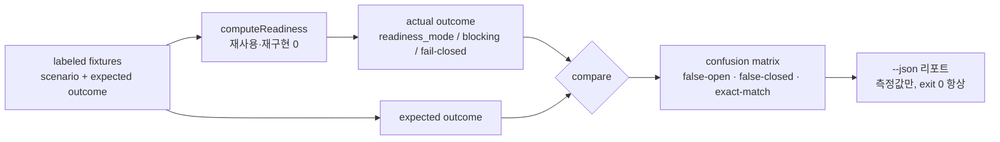

# Eval & Calibration Harness — readiness/judgment 정확도 측정 — frontend-workflow-kit 투입 아이디어 리서치

> 날짜: 2026-07-05 · status: draft(리서치 산출물, 게이트 아님)
> 이 문서는 research evidence 다. 아무 게이트도 내리지 않고(gates nothing), 채택은 별도 Open Decision + 사람 승인을 따른다.

---

## 한 줄 결론

킷은 `readiness_mode = min(fact_mode, decision_cap)`·malformed Open Decision fail-closed·ambiguity 후보화 같은 **고위험 판정**을 매 실행 내리지만, 그 판정이 *맞는지*(false-open/false-closed 비율, 게이트 precision/recall)를 측정하는 장치가 **하나도 없다**. 이미 있는 golden-fixture 패턴([`test-fixtures.mjs`](../../../frontend-workflow-kit/scripts/test-fixtures.mjs) · [`readiness-failopen.test.mjs`](../../../frontend-workflow-kit/scripts/lib/readiness-failopen.test.mjs))을 **라벨된 시나리오 + expected outcome** 으로 확장해 confusion-matrix 형 지표(특히 치명적인 **false-open**)를 결정적으로 리포트하는 **eval harness** 를 제안한다. eval 은 **측정이지 게이트가 아니다** — 어떤 정본도 바꾸지 않고, exit code 로 진행을 막지 않는다.

---

## 1. 문제 — 판정은 많은데, 판정의 정확도를 재는 게 없다

### 1.1 킷은 이미 여러 고위험 판정을 내린다

판정의 단일 출처인 [`readiness.mjs`](../../../frontend-workflow-kit/scripts/readiness.mjs)(불변식 1)는 화면마다 다음을 계산한다.

- **다운그레이드 판정**: `fact_mode`(open decision 무시)와 `decision_cap`(열린 결정의 최저 Blocking Mode 바로 아래)을 각각 구하고 **하한을 택한다**. 코드는 `const chosenIdx = Math.max(0, Math.min(factIdx, decisionCapIdx))`([readiness.mjs:361](../../../frontend-workflow-kit/scripts/readiness.mjs)). 규칙 정본은 [open-decisions.md](../../../kit-dev/open-decisions.md) — "`readiness.mjs` 는 두 값을 분리해 계산하고, **반드시 둘의 하한을 택한다**(이게 다운그레이드 불변식이다)".
- **fail-closed 판정 (Open Decision)**: 해석 불가한 Open Decision(정책에 없는 Blocking Mode·ID/Status 누락·`docs-only` floor·표 없음)이 하나라도 있으면 화면을 `docs-only` 로 고정한다. 코드는 `if (invalidDecisions.length > 0) decisionCapIdx = 0`([readiness.mjs:357-359](../../../frontend-workflow-kit/scripts/readiness.mjs)). 정본은 open-decisions.md "**malformed Open Decision 은 fail-closed 다** … 오타 한 글자나 깨진 표로 게이트 전체가 풀리는 fail-open 이 된다".
- **fail-closed 판정 (policy requires)**: 파싱 불가한 정책 요구조건(`ci_lint = pass` 같은 오타)을 skip 하지 않고 `failed` 로 밀어 넣어 그 모드를 막는다([readiness.mjs:214-220](../../../frontend-workflow-kit/scripts/readiness.mjs)).
- **ambiguity/critic 후보화 판정 (실행 루프)**: [SYNTHESIS.md](../../../temp/execution-loop-research/SYNTHESIS.md) 파이프라인의 AMBIGUITY_GATE·Author/Reviewer/Fixer 는 "애매함을 놓치지 않았나"·"이 리뷰 지적이 blocker-candidate 인가"를 판단한다(§1, §9.3).

각 판정은 **잘못되면 대가가 크다**. false-open(막았어야 할 화면을 열어줌)은 LLM 이 결정 없는 상태로 최종 UI/API 통합을 진행하게 두는 것이고, false-closed(열려야 할 화면을 막음)는 정상 작업을 시끄럽게 막아 규율을 마모시킨다.

### 1.2 그런데 "이 판정이 맞나?"를 재는 계측이 없다

현재 테스트 자산은 **두 종류**뿐이고, 둘 다 정확도(accuracy)를 재지 않는다.

| 자산 | 무엇을 검사하나 | 무엇을 못 재나 |
|---|---|---|
| [`readiness-failopen.test.mjs`](../../../frontend-workflow-kit/scripts/lib/readiness-failopen.test.mjs) | malformed `requires` 한 종류에서 `readiness_mode` 가 기대값과 같은지 (회귀) | 다양한 시나리오 스펙트럼에서의 false-open/false-closed **비율** |
| [`test-fixtures.mjs`](../../../frontend-workflow-kit/scripts/test-fixtures.mjs) 의 `pipeline` 검사 | 예제 트리의 state/readiness/validate 출력이 커밋된 스냅샷과 **텍스트 일치**하는지 | 그 스냅샷이 애초에 **옳은 판정인지** (스냅샷은 "현재 출력"일 뿐 "정답"이 아님) |

핵심 간극: `pipeline` 검사는 "출력이 어제와 같은가"(regression)를 재지, "출력이 정답인가"(correctness)를 재지 않는다. 스냅샷은 **regression oracle** 이지 **correctness oracle** 이 아니다. 판정 로직에 버그가 있어도 스냅샷과 로직이 함께 틀리면 초록불이 켜진다. 이것이 SYNTHESIS 의 **green ≠ done** 테제와 정확히 같은 층위의 문제다(§2 행 D: "멱등 PASS ≠ 정확성").

### 1.3 SYNTHESIS 가 이 질문을 명시적으로 유보했다

실행 루프 종합은 남은 결정 §8-4 에서 이 측정을 **딥리서치 밖으로 분리**했다.

> **실측 트랙(별도)**: critic 실효성·ask 임계 보정은 *조사*가 아니라 **coupon-feature A/B 측정** 과제 — 별도 태스크로 분리(딥리서치로는 안 풀림). — [SYNTHESIS.md §8](../../../temp/execution-loop-research/SYNTHESIS.md)

즉 "게이트/critic 이 실제로 정확한가"는 **설계상 미답 상태**다. 본 제안은 그 유보된 "실측 트랙"에 형식(라벨된 fixture + 결정적 실행 + confusion-matrix 리포트)을 부여한다. SYNTHESIS 는 이 harness 가 무엇을 재야 하는지 정의하지 않았으므로 본 문서는 그것을 **보완**하되 **중복하지 않는다**.

---

## 2. 무엇을 eval 하나 — 판정의 정확도, 그중 false-open 이 치명

eval 대상은 산출물의 시각/기능 품질이 아니라 **판정 함수의 출력이 라벨과 일치하는가**다. 세 축을 잡는다.

```txt
축 1  readiness_mode 정확도   시나리오 → 기대 readiness_mode / next_mode 가 맞나
축 2  fail-closed 정확도       malformed 입력 → docs-only 로 고정되나 (게이트가 안 풀리나)
축 3  blocking 판정 정확도     기대 blocking decision / blocker 종류가 surface 되나
```

혼동행렬은 **"화면이 특정 모드로 진입 가능한가"** 이진 판정 기준으로 정의한다. gate 판정을 분류기로 보면:

| | 실제로 막혀야 함 (label=block) | 실제로 열려야 함 (label=open) |
|---|---|---|
| **판정: 막음** | true-closed (정상) | **false-closed** (over-block — 규율 마모) |
| **판정: 열음** | **false-open** (위험 — LLM 이 결정 없이 진행) | true-open (정상) |

- **false-open = 가장 위험한 오류.** 막았어야 할 판정을 열어주면 open decision 미해결 상태로 상위 모드 진행이 뚫린다. open-decisions.md 가 fail-closed 를 두는 이유("오타 한 글자로 게이트 전체가 풀리는 fail-open") 자체가 false-open 을 최악으로 본다는 증거다. → eval 은 **false-open rate(=recall miss)** 를 1급 지표로 리포트한다.
- **false-closed = 덜 위험하지만 무시 못 함.** [`readiness-failopen.test.mjs`](../../../frontend-workflow-kit/scripts/lib/readiness-failopen.test.mjs) 의 `control:` 케이스("well-formed requires 는 정상적으로 모드를 열어준다 — over-block 회귀 방지")가 이미 false-closed 회귀를 한 건씩 막고 있다. eval 은 이를 **비율**로 일반화한다.

셋 다 이미 코드로 존재하는 판정이므로 eval 은 **새 판정 로직을 만들지 않는다** — `computeReadiness` 를 그대로 소비해 출력을 라벨과 대조할 뿐이다(불변식 1 보존).

---

## 3. 선행/유사 사례 (web 보강)

이 제안은 발명이 아니라 세 계열의 확립된 실무를 킷의 golden-fixture 패턴에 맞춘 것이다.

### 3.1 LLM-as-judge calibration — judge 의 TPR/FPR 를 라벨로 추정

LLM 판정자(judge)를 신뢰하기 전에 **소량의 human-labeled calibration set** 으로 그 judge 의 True Positive Rate / False Positive Rate 를 추정하는 것이 2025~2026 표준 실무다. 최근 연구는 judge 의 오류 프로파일을 명시적으로 모델링해 Type-I error 를 유한표본에서 통제한다([Noisy but Valid, arXiv 2601.20913](https://arxiv.org/html/2601.20913)). 실측된 judge 들은 **precision 은 높지만(0.81~0.94) recall 이 낮고 예측 불가**해 실제 위험을 크게 놓치며, 보수적 skew 로 false-positive/false-negative 비가 14:1 까지 벌어진다([No Free Labels, arXiv 2503.05061](https://arxiv.org/html/2503.05061v1)). 핵심 교훈: **judge 든 gate 든, 라벨 대조 없이는 자기가 얼마나 틀리는지 모른다.** 킷의 readiness 판정도 정확히 이 계열의 자동 판정자다.

### 3.2 SWE-bench Verified — human-validated 라벨 + 결정적 oracle

SWE-bench 계열의 핵심은 **결정적 채점**이다: 후보 패치를 적용하고 지정 테스트 스위트를 돌려 전부 통과하면 성공([SWE-bench technical report, Cognition](https://cognition.ai/blog/swe-bench-technical-report)). SWE-bench **Verified** 는 500개 과제를 사람이 검수해 만든 gold standard 로, 각 과제에 난이도 라벨과 hidden test 로 된 pass/fail oracle 이 붙는다([SWE-bench Verified](https://www.emergentmind.com/topics/swe-bench-verified-f1d87e7f-d600-4831-973d-249d445ba3d0)). 취할 패턴: **(a) 사람이 검증한 라벨 fixture, (b) 결정적 실행, (c) pass/fail oracle 을 fixture 옆에 고정.** 킷의 `test-fixtures.mjs` 는 이미 (b)(c) 의 절반(regression oracle)을 갖췄다 — 빠진 것은 (a) **정답 라벨**이다.

### 3.3 Confusion matrix / precision-recall for gate systems

이진 게이트를 분류기로 보고 accuracy·F1·FPR·FNR 로 재는 것은 안전/콘텐츠 게이트 평가의 기본 계량이다([Know Thy Judge, arXiv 2503.04474](https://arxiv.org/html/2503.04474v1)). gate 는 operating point(임계)를 가진 분류기이고, false-open(unsafe→safe 로 오판)과 false-closed(safe→unsafe)는 비용이 비대칭이므로 **한 숫자(accuracy)가 아니라 혼동행렬 전체**를 봐야 한다. 이는 §2 의 비대칭 비용 프레이밍과 정확히 일치한다.

**종합**: 세 계열 모두 "자동 판정자는 라벨된 fixture 로 결정적으로 재고, 단일 숫자가 아니라 혼동행렬(특히 위험 쪽 오류)로 보고한다"로 수렴한다. 킷은 이 관행의 (b)(c)를 이미 갖췄고 (a) 라벨과 리포트 형식만 더하면 된다.

---

## 4. 제안 설계 — 라벨된 시나리오 + 결정적 실행 + 혼동행렬 리포트

### 4.1 한 장 그림



### 4.2 라벨된 fixture 스키마 (시나리오 + expected outcome)

기존 `run-metadata.json` 규약([test-fixtures.mjs:124](../../../frontend-workflow-kit/scripts/test-fixtures.mjs))을 그대로 확장한다 — 새 파일 종류가 아니라 **새 `kind: 'eval'`** 한 줄. 각 fixture 는 최소한의 상태 스텁 + 기대 판정을 담는다.

```jsonc
// examples/readiness-eval/<case>/eval-metadata.json
{
  "fixture": "readiness-eval",
  "scenario": "final-blocking open decision on authored screen",
  "docs": "docs/frontend-workflow",         // 기존처럼 상대경로
  "label": {                                  // ← 정답 (사람이 검증)
    "screen": "COUPON-001",
    "expected_readiness_mode": "rough-fixture-ui",
    "expected_next_mode": "final-fixture-ui",
    "expected_blocking_kinds": ["open_decision"],
    "expected_fail_closed": false
  },
  "label_source": "human-reviewed 2026-07-05 / open-decisions.md golden",
  "rationale": "D-001 blocks final-fixture-ui; facts otherwise allow it → min() downgrades"
}
```

- `label` 은 [`readiness-failopen.test.mjs`](../../../frontend-workflow-kit/scripts/lib/readiness-failopen.test.mjs) 의 `assert.equal(r.readiness_mode, ...)` 와 같은 정보지만, **fixture 옆에 데이터로 선언**되어 여러 시나리오를 표로 집계할 수 있다.
- `label_source` 는 라벨이 어디서 왔는지(사람 검수 날짜·근거 문서)를 박아 **라벨 provenance** 를 강제한다 — 라벨 편향(§6)을 관리하기 위한 최소 장치.
- 스텁 상태는 이미 존재하는 golden 트리(coupon-feature, api-schema-match, input-validation)를 그대로 가리키거나, `readiness-failopen.test.mjs` 의 `policyWithFinalRequires`/`stateAuthored` 처럼 in-fixture 최소 스텁을 둔다.

### 4.3 결정적 실행 — 판정 재구현 0

`test-fixtures.mjs` 의 `computePipelineActual` 이 이미 하는 방식 그대로: `computeReadiness` 를 **import 해서 소비**하고 출력을 라벨과 대조한다([test-fixtures.mjs:403-410](../../../frontend-workflow-kit/scripts/test-fixtures.mjs)). eval harness 는 판정 로직을 한 줄도 다시 쓰지 않는다(불변식 1). 결정성은 기존 harness 와 동일하게 보장된다(정렬·타임스탬프 정규화).

### 4.4 혼동행렬 리포트 (`--json`)

각 fixture 를 `label vs actual` 로 채점해 화면·판정축별로 집계한다.

```jsonc
// node scripts/readiness-eval.mjs --json
{
  "ok": true,                      // 항상 측정 성공 여부일 뿐 — 게이트 아님
  "total": 24,
  "exact_match": 21,               // readiness_mode 완전 일치
  "confusion": {
    "false_open":   { "count": 1, "cases": ["eval/stale-cap-001"] },   // ← 치명, 별도 강조
    "false_closed": { "count": 2, "cases": ["eval/overblock-003", "eval/overblock-007"] },
    "true_open": 12,
    "true_closed": 8
  },
  "fail_closed_axis": { "expected": 6, "correct": 6, "leaked": 0 },     // fail-open leak = 0 이어야
  "by_blocking_kind": { "open_decision": {"precision": 0.94, "recall": 0.90} }
}
```

- exit code 는 **항상 0**(측정 성공 시) — eval 은 CI 를 빨갛게 만들지 않는다. 리포트는 관측값이다.
- `false_open` 과 `fail_closed_axis.leaked` 는 별도 필드로 승격해 "게이트가 풀렸다"를 한눈에.
- 불변식 9 대로 `--json` 지원, 의존성은 Node 내장 + 기존 `yaml` 만.

### 4.5 왜 새 축이 아닌가

eval 은 산출물(ScreenSpec/카탈로그/코드) 축을 하나도 추가하지 않는다. 입력은 **이미 있는** state/policy/fixture 이고, 출력은 **레포 밖 리포트**(temp/reports 류)다. artifact-manifest 에 새 산출물을 등록하지 않는다 — 따라서 roadmap "새 산출물 축 추가 금지"에 저촉되지 않는다.

---

## 5. 단계적 도입

위험도 오름차순. 각 Phase 는 독립적으로 유용하고, `workflow:run` 이나 telemetry 를 기다리지 않는다.

### Phase 0 — 기존 golden 을 라벨링 (거의 무위험, 첫 PR)
- `readiness-failopen.test.mjs` 의 7개 케이스와 `coupon-feature`/`api-schema-match`(pass-*/fail-*)/`input-validation`(pass/fail/warn) 트리에 **이미 내재된 기대값**을 `eval-metadata.json` 라벨로 명시화한다. 새 판정 없음 — 흩어진 assert 를 데이터로 모으는 작업.
- 산출: 라벨 fixture 20~30개 + `label_source` provenance. 리포트 스크립트 없이 스키마만 먼저.

### Phase 1 — eval 스크립트 + 혼동행렬 리포트
- `scripts/readiness-eval.mjs`: `computeReadiness` 소비 → 라벨 대조 → §4.4 `--json`. `test-fixtures.mjs` 의 `runFixture` 패턴 재사용.
- `package.json` 에 `workflow:eval` 추가(선택). CI 에는 **warning-first**(리포트 출력만, 게이트 배선 없음) — route-cross-check·lint-pack 이 warning-first 로 들어온 것과 동형.

### Phase 2 — 시나리오 스펙트럼 확장 + 회귀 트래킹
- false-open 을 노리는 경계 시나리오(stale decision_cap, 부분 malformed, 정책 모드 오타)를 라벨과 함께 추가. false-open rate 시계열을 리포트로 축적(판정 로직 변경 전후 비교).

### Phase 3 — 실행 루프 판정으로 확장 (SYNTHESIS §8-4 의 실측 트랙)
- AMBIGUITY_GATE·critic 판정에 대한 라벨 fixture. 단 이는 SYNTHESIS 가 "A/B 측정 과제"로 분리한 영역이라 **A/B 설계와 결합**해야 하고 딥리서치로 안 닫힌다 — 본 harness 는 그 A/B 의 오프라인 정확도 절반만 담당한다.

---

## 6. 리스크

| 리스크 | 내용 | 완화 |
|---|---|---|
| **라벨 편향** | 라벨을 판정 로직 작성자가 붙이면 "코드가 하는 대로가 곧 정답"이 되어 버그를 함께 라벨링한다 | `label_source` 로 provenance 강제 · 라벨 근거를 open-decisions.md 등 **판정 로직 아닌 정본**에 앵커 · 라벨 검수는 사람(불변식 6 계열) |
| **overfitting to fixtures** | fixture 에만 맞춰 판정을 튜닝하면 실제 분포에서 정확도가 떨어진다 | fixture 는 회귀·경계 사례이지 대표표본이 아님을 리포트에 명시 · Phase 3 의 실측(A/B)이 최종 검증 |
| **eval 을 게이트로 오용** | false-open rate 를 exit 1 로 배선하면 "LLM/스크립트가 게이트를 내리는 자동화"가 되어 불변식 위반 | exit **항상 0** · CI 는 warning-first · SYNTHESIS §9.6 "절대 코드로 구현하지 말 것"과 동일 규율 — eval 결과로 readiness 를 덮어쓰거나 진행을 막지 않는다 |
| **라벨 유지비** | 판정 로직이 정당하게 진화하면 라벨도 갱신해야 함 | 라벨 갱신은 사람 리뷰 이벤트로만(스냅샷 `--update` 와 달리 라벨은 자동 갱신 금지) |

---

## 7. 불변식 정합성

9 불변식([IMPLEMENTING.md §4](../../../IMPLEMENTING.md)) + roadmap "지금 하지 말 것"([roadmap-current.md](../../../kit-dev/roadmap-current.md)) 대조.

| 불변식 / 금지 | 판정 | 근거 |
|---|---|---|
| 1. 판정 로직은 한 곳(readiness.mjs) | ✅ | eval 은 `computeReadiness` 를 **소비만** 함 — 판정 재구현 0([test-fixtures.mjs:403](../../../frontend-workflow-kit/scripts/test-fixtures.mjs) 동일 패턴) |
| 2. 파생값 frontmatter 금지 | ✅ | 라벨은 `eval-metadata.json`(fixture 사이드카), frontmatter 미접촉 |
| 3. GENERATED 마커 | ✅ 무관 | eval 은 산출물 생성기가 아님(리포트만) |
| 4. 사실의 단일 출처 | ✅ | 라벨 provenance 를 정본 문서에 앵커, 코드 사본 금지 |
| 5. 화면 AsyncState 계약 | ✅ 무관 | 화면 코드 미접촉 |
| 6. confirmed 승격은 사람만 | ✅ | 라벨 검수·갱신은 사람 이벤트, eval 이 자동 승격/게이트 해제 안 함 |
| 7. 생성기 멱등 | ✅ | 결정적 실행(정규화), 같은 fixture→같은 리포트 |
| 8. 최종 방어선 npm+CI, 훅은 얇은 wrapper | ✅ | eval 은 방어선이 **아님** — 측정. CI warning-first |
| 9. `--json` + 의존성 최소 | ✅ | `--json` 리포트, Node 내장 + 기존 `yaml` |
| 금지: 새 산출물 축 추가 | ✅ | manifest 에 산출물 미등록, 리포트는 레포 밖(§4.5) |
| 금지: LLM 이 게이트 내리는 자동화 | ✅ | exit 항상 0, readiness 미변경 — **eval 은 게이트가 아니라 측정** |
| 금지: Unknown/Conflict/Review 를 readiness 게이트화 | ✅ | eval 은 어떤 것도 게이트로 승격하지 않음 |

핵심: **eval 은 measurement, never a gate.** 이 한 줄이 정합성의 전부다 — 재는 것은 새 권한이 아니다.

---

## 8. 핵심 주장 검증

| 주장 | 판정 | 근거 (실제 파일) |
|---|---|---|
| 킷은 `readiness_mode = min(fact_mode, decision_cap)` 다운그레이드 판정을 코드로 내린다 | ✅ 확인 | [readiness.mjs:361](../../../frontend-workflow-kit/scripts/readiness.mjs) `Math.max(0, Math.min(factIdx, decisionCapIdx))` · [open-decisions.md](../../../kit-dev/open-decisions.md) "반드시 둘의 하한을 택한다" |
| malformed Open Decision 은 fail-closed(docs-only 고정)다 | ✅ 확인 | [readiness.mjs:357-359](../../../frontend-workflow-kit/scripts/readiness.mjs) `if (invalidDecisions.length > 0) decisionCapIdx = 0` · [open-decisions.md](../../../kit-dev/open-decisions.md) "malformed Open Decision 은 fail-closed 다" |
| malformed policy `requires` 도 fail-closed(skip 아님)다 | ✅ 확인 | [readiness.mjs:214-220](../../../frontend-workflow-kit/scripts/readiness.mjs) `failed.push({ malformed: true, ... })` |
| 판정 정확도를 재는 계측이 없다 — 기존 자산은 regression oracle 이지 correctness oracle 이 아니다 | ✅ 확인 | [test-fixtures.mjs](../../../frontend-workflow-kit/scripts/test-fixtures.mjs) pipeline 검사는 "커밋된 기대값과 텍스트 일치"만 · [readiness-failopen.test.mjs](../../../frontend-workflow-kit/scripts/lib/readiness-failopen.test.mjs) 는 단일 회귀 케이스 |
| SYNTHESIS 가 정확도 실측을 딥리서치 밖으로 유보했다 | ✅ 확인 | [SYNTHESIS.md §8-4](../../../temp/execution-loop-research/SYNTHESIS.md) "실측 트랙(별도) … 딥리서치로는 안 풀림" |
| green ≠ done 은 SYNTHESIS 의 명시 테제다 | ✅ 확인 | [SYNTHESIS.md §2 행 D](../../../temp/execution-loop-research/SYNTHESIS.md) "멱등 PASS ≠ 정확성" |
| 라벨 seed 가 될 pass/fail golden 이 이미 있다 | ✅ 확인 | [examples/coupon-feature/](../../../frontend-workflow-kit/examples/coupon-feature/) · [api-schema-match/](../../../frontend-workflow-kit/examples/api-schema-match/) (pass-*/fail-*) · [input-validation/](../../../frontend-workflow-kit/examples/input-validation/) (pass/fail/warn) |
| 라벨 스키마는 기존 run-metadata 규약의 확장으로 가능 | ✅ 확인 | [test-fixtures.mjs:124-264](../../../frontend-workflow-kit/scripts/test-fixtures.mjs) `readRunMeta`/`readGeneratedViewCases` 패턴 |
| eval 은 판정을 재사용해 재구현 0 이 가능하다 | ✅ 확인 | [test-fixtures.mjs:403-410](../../../frontend-workflow-kit/scripts/test-fixtures.mjs) `computePipelineActual` 이 `computeReadiness` import 소비 |

---

## 9. 남은 사람 결정

- **채택 여부·순서**: 이 harness 를 언제 넣을지는 Open Decision + 사람 승인 사안(이 문서는 게이트가 아님).
- **라벨 authority**: 라벨을 누가 검수·승인하나(PM/FE/설계자?). provenance 정책의 owner.
- **false-open 허용선**: 리포트만 볼지, 특정 임계 초과 시 사람에게 **에스컬레이션**(게이트 아님)할지 — 후자도 exit 0 유지가 조건.
- **Phase 3 진입 기준**: 실행 루프 판정 eval 은 SYNTHESIS 의 A/B 측정 트랙과 묶여야 하므로, 그 트랙이 별도로 승인된 뒤에만.

---

## 관련 문서 (cross-ref)

- [`./01-telemetry-and-promotion-evidence.md`](./01-telemetry-and-promotion-evidence.md) — telemetry 는 **관측**(무엇이 일어났나), eval 은 **정확도**(판정이 맞았나). 상보적 — telemetry 가 모은 실행 로그가 Phase 2 의 시나리오 분포 근거가 될 수 있다.
- [`./04-adversarial-reward-hacking-redteam.md`](./04-adversarial-reward-hacking-redteam.md) — red-team 은 **적대적 eval 의 특수 케이스**(공격자가 만든 false-open 유발 fixture). 본 harness 의 라벨 스키마·리포트 형식을 그대로 재사용하되 입력을 적대적으로 생성.
- [`../../../temp/execution-loop-research/SYNTHESIS.md`](../../../temp/execution-loop-research/SYNTHESIS.md) — 본 문서는 §8-4 의 유보된 "실측 트랙"에 형식을 부여해 **보완**한다. SYNTHESIS 의 파이프라인/불변식을 중복하지 않는다.
