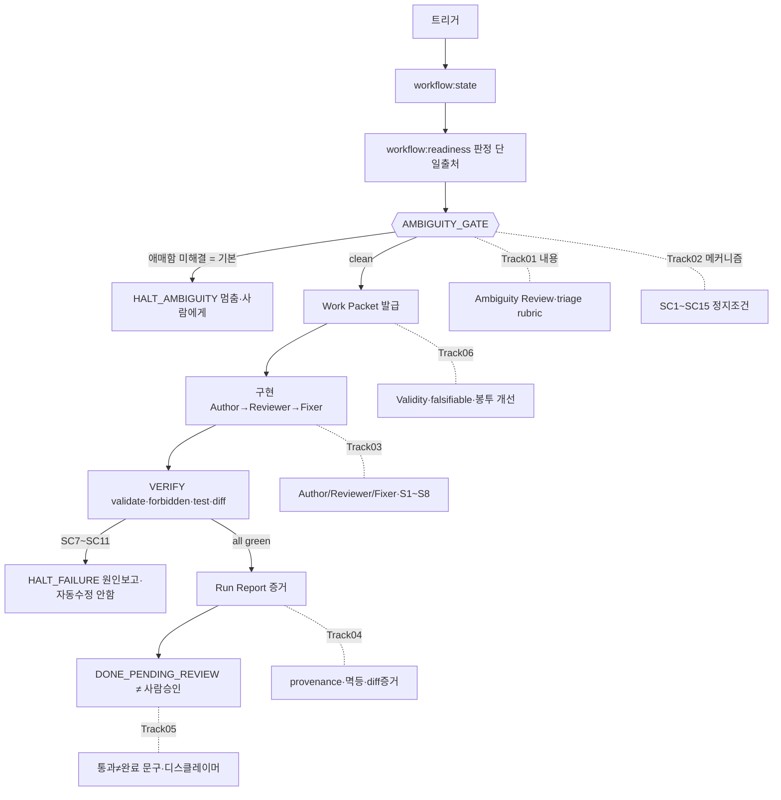

# Execution Loop / Work Packet Runner — 6트랙 종합 (1차)

## 0. 종합 메모 (신뢰도)

- **6트랙은 충돌하는 별개 제안이 아니라 하나의 파이프라인으로 수렴한다.** Track 02(auto-stop 상태기계)가 척추이고, 01·03·04·05·06이 그 상태들에 내용을 채운다.
- **신뢰도 주의**: 5/6 트랙의 자동 적대적 검증이 동시-burst rate-limit 으로 전멸 → 수동 재검증으로 복원. Track 01은 자동 "25/25 반박"이 위양성(재검증 결과 확인 19·부분 3·교정 1·접근불가 2)임을 입증했고, 그 과정에서 green 쪽 과장 추출 1건(arXiv 2605.06717)도 교정했다. **즉 이 묶음 자체가 Track 05 테제(자동 green/red verdict 불신)의 실사례다.** 아래 종합은 raw 파이프라인 출력이 아니라 수동 재검증분 기반.
- **코덱스 독립 리뷰 반영 (2026-06-14)**: 코덱스가 *이 종합을 못 본 채* 6보고서만 보고 같은 척추에 수렴 — 강한 교차검증. 그 리뷰의 정합성 지적(어휘 중복·층위·verdict 사회적 게이트화·Run Report 과중·PR 분할)을 **§9 로 reconcile**. 사내 표준이 **GitLab** 이므로 review 근거는 GitHub 한정에서 플랫폼 중립으로 일반화(§9.3).

---

## 1. 한 장 그림 — 6트랙이 합쳐지는 단일 파이프라인



- **트랙 분담 한 줄 요약**: 02 = 상태기계(멈춤이 기본) · 01 = AMBIGUITY_GATE 의 *내용* · 03 = IMPLEMENT 의 리뷰 프로토콜 · 04 = REPORT 의 증거 스키마 · 06 = PACKET 봉투 개선 · 05 = 전 구간에 "통과≠완료" 문구.
- **시스템의 첫 질문 = "구현 가능?"이 아니라 "애매한 거 놓친 거 없나?"** → 기본 종료가 `HALT_AMBIGUITY`(구현 전 멈춤). 이게 doc 1(루프)+doc 2(auto-stop)+6트랙 전부가 수렴하는 한 점이다.

---

## 2. 합의 교차표 (consensus — 2개 이상 트랙이 같은 결론)

| # | 합의 사항 | 트랙 | 종합 처리 |
|---|---|---|---|
| A | **단일 stop 상태기계 공유.** 01 `Safe To Proceed?=no` = 02 `SC1~15` = 05 escalate-on-risk 는 *같은 전이*를 셋이 다르게 기술 | 01·02·05 | 02 의 상태기계로 통일. 01 이 AMBIGUITY_GATE 내용 공급, 05 가 문구 공급 |
| B | **Ambiguity Review → runner 입력 계약 필요.** 01 이 섹션 생성 → 02 SC5/SC6 가 읽음 → 03 S3 이 Human-only 로 라우팅 → 06 이 Blocking Items 로 흡수 | 01·02·03·06 | Ambiguity Review 는 work-packet 섹션(01 스키마)으로, Blocking Items 로 흘러가고(06), 02 의 [의미] 정지신호 입력이 됨 |
| C | **review verdict = advisory, 머지 게이트 아님.** 03 이 이게 GitHub 의 *기본 동작*(branch protection 켤 때만 차단)임을 1차 출처로 입증 | 02·03·05·06 | verdict 는 evidence. runner 의 review-BLOCKER 정지(SC11)는 *에스컬레이션*이지 머지차단 아님 |
| D | **green ≠ done.** 02 종료상태 `DONE_PENDING_REVIEW`, 04 "멱등 PASS≠정확성", 01 "빈 Ambiguity Review≠설계충분", 05 가 총괄 | 01·02·03·04·05 | Track 05 가 정본 소유. `DONE_PENDING_REVIEW` 네이밍 + PASS 디스클레이머가 전 구간 전파 |
| E | **re-run ≠ re-judge.** 04 멱등 체크가 readiness 재실행(witness)하되 재판정 안 함 / 06 Validity 가 stale 방어하되 자동 스크립트 금지 | 04·06 | 타임스탬프·해시 *기록*은 evidence, 그걸로 *자동 차단*하면 위반 |
| F | **못 보는 건 위임.** Node runner 는 LLM 토큰을 못 잼 → 비용상한(SC12)은 하니스 위임, runner 는 iteration/wall-clock/fingerprint 로 방어 | 02·04 | §7-1 보강조사 대상 |
| G | **선행사례 입증.** Kiro "게이트≠문서", DoR "stage-gate 회피", GitHub "advisory 기본"이 repo 불변식을 *발명이 아니라 정설*로 뒷받침 | 03·06 | 불변식 유지가 곧 업계 베스트프랙티스라는 근거로 README 에 인용 가능 |

---

## 3. 충돌/분기 + 해소

실제 방향 충돌은 **없다**(6트랙 모두 불변식 자가검증 통과). 아래는 경계·문구 분기 3건과 종합의 결론.

| 분기 | 내용 | 해소 |
|---|---|---|
| **DoR-as-gate 프레이밍** (01 vs 06) | 01(rgalen 재검증): "게이트 메커니즘 자체가 악이 아니라 *무엇을* gate 하느냐가 문제 — 강 신호 blocking 결정엔 게이트 유효". 06(Mike Cohn): "X 100% 끝나야 Y" 규칙은 stage-gate=waterfall, DoR 은 가벼운 가이드로 | **둘 다 만족**: `Safe To Proceed?`·Ambiguity Review 는 **warning-only 텍스트**, exit 1 금지. 실제 게이트는 *항상* 기존 Open Decision(readiness cap) — 즉 "강 신호를 gate" 하긴 하되 그 게이트는 신설이 아니라 기존 readiness 다. MVP 는 더 보수적인 06 해석 채택 |
| **디스클레이머 위치** (05 내부) | PASS 디스클레이머를 `.mjs` stdout 에 넣으면 로직 불변이나 *파일* 수정. 02·03 은 "스크립트 무수정" 고수 | **05 권고 채택**: 디스클레이머는 Skill 프롬프트 + README + 템플릿에만. `.mjs` **0 수정**. 첫 PR 도 작아짐 |
| **EARS 문법** (06 내부) | Expected Output 을 EARS "WHEN…THEN…"로? 06 스스로 "EARS 는 UI 행위 지향이라 path/mode-천장 제약엔 안 맞을 수도" | **EARS 정신만**(이진 체크가능) 채택, **문법 미채택**. work-packet Acceptance Criteria 가 이미 `git diff`/`exit 0` 이진검사라 충족. Expected Output 문구만 다듬음 |

---

## 4. 불변식 위반 후보 점검 (②)

**반복되는 단일 위험 = "[의미] 신호를 exit-1 게이트로 굳히는 것."** 6트랙이 각자 같은 함정을 다른 자리에서 경고한다. 전부 같은 원칙으로 해소: **멈춤/에스컬레이션 ≠ 게이트, 증거 ≠ 판정. 게이트는 오직 readiness(Open Decision + 정책 fact) + validate(구조)뿐.**

| 드리프트 후보 (위반이 되는 순간) | 트랙 | 가드 (이게 지켜지면 안전) |
|---|---|---|
| `Safe To Proceed?`/Ambiguity Review 를 파싱해 exit 1 | 01 | warning-only 텍스트. 승격은 사람이 Open Decision 으로 — 그때만 readiness 가 막음 |
| SC6 "blocking Unknown" 을 게이트 취급 (불변식 5) | 02 | SC6 = [의미] MAJOR-ESC = "멈춰서 사람에게 triage 요청"이지 "Unknown=게이트" 아님. 막는 건 승격된 Open Decision |
| SC11 "review BLOCKER" 를 머지차단 (불변식 9) | 02·03 | runner 정지 = 에스컬레이션. 머지 결정은 사람. 종료 `DONE_PENDING_REVIEW`(green)와 분리 |
| review verdict 를 validate.mjs exit / required check 에 배선 | 03 | verdict 는 advisory evidence. 검사 12종에 추가 금지. CI 올리면 non-required check/PR comment 로만 |
| PASS 디스클레이머를 exit 1 경고-게이트로 | 05 | 문구는 문구로. 빈도·배치만 설계(run당 1회·위험할 때만) |
| Validity stale 검사를 자동 스크립트로 | 06 | 사람이 확인하는 assertion. 자동화하면 봉투가 판정자됨 |
| 멱등 재실행 결과로 readiness 덮어쓰기/머지차단 | 04 | re-run(witness) ≠ re-judge(gate). 출력은 회귀 비교용일 뿐 |
| auto-retry 가 테스트/golden/readiness-입력 수정 (reward hacking) | 02 | forbidden-set 1순위. auto-retry 기본 OFF |
| LLM 이 D-cand/U-cand 를 ScreenSpec 에 직접 확정 | 01·03 | packet 안 "후보"로만. 승격·resolve·close 전부 사람 |

**결론**: 10개 불변식 모두 위반 없음. 잔여 위험은 전부 "표기/라우팅 규칙 + 사람 규율"에 의존하는 성격(기술적 강제 아님)이라, 첫 PR 이 **새 실행 경로·새 게이트를 0개** 만들면 위험이 가장 낮다(→ §6).

---

## 5. 우선순위 통합 설계 (③)

전체는 하나의 파이프라인이지만, **구현은 위험도 오름차순 4단계**로 쪼갠다.

### Phase 0 — 문서/템플릿만 (실행경로 0, 게이트 0, 거의 무위험) ★ 첫 PR
모두 markdown 편집. `workflow:run` 이 영영 안 나와도 독립적으로 유용하고, repo 의 "warning-first" 문화와 정합. "auto-stop, ask-first" 철학을 *자동화 전에 문서로* 먼저 박는다.
- **05**: README "하는 것 vs 안 하는 것" 프레이밍 + 6 금지착각 / Skill callout + 금지 1줄 / Work Packet 헤더·Run Report 푸터 디스클레이머.
- **06**: work-packet 템플릿 패치 (Validity 무효조건 · Expected Output 반증가능 문구 · Must Read "여기부터" · Blocking Items 가 Ambiguity 입력원 · Review Checklist 에 Pre-Implementation 행).
- **01**: work-packet 에 `Ambiguity Review Required` 섹션 + Unknown→Open Decision triage rubric(결정트리·신호표·Blocking Mode 매핑) + 모드별 Safe-To-Proceed 표 (전부 warning-only).
- **03**: review-artifact 에 Semantic Review 루브릭 S1~S8 + verdict-as-evidence 표기 규칙 / run-report 에 Review Evidence(advisory) 섹션.
- **04**: run-report 증거 스키마 주석 강화(`readiness_source`=builder.id 등가, 빈 diff=PASS, blockers verbatim) — 대부분 이미 템플릿에 있음, 문구 격상만.

### Phase 1 — 실행 계층 (※ §9.5 에서 packet→report→run 3 PR 로 분할)
- **PR2 `workflow:packet`** → **PR3 `workflow:report`** → **PR4 `workflow:run`**(auto-stop 상태기계). 생성기 먼저·상태기계 나중 = 더 점진적이고 notes/01 원안과 정합.
- 공통: 기존 4 스크립트를 **서브프로세스로 소비**(판정 재구현 0), `computeReadiness` 출력 *복사*만, **순수 auto-stop·auto-retry 없음**, 기본 종료 `HALT_AMBIGUITY`. 기계적 정지조건 SC1~SC4 / SC7~SC10 / SC13~SC15.

### Phase 2 — 의미 배선
- AMBIGUITY_GATE 의 [의미] 입력 계약 확정 후 SC5/SC6 연결(01↔02 open question).
- Author/Reviewer/Fixer 루프(03) + SC11 review verdict 입력.
- run-report 멱등 자동 체크(04: regenerate-then-empty-diff + canonicalize-before-compare).

### Phase 3 — 보류/아마-안함
auto-retry narrow band(02 §4-3) · confidence 주석(06/Devin식) · 파일 SHA-256 digest(04) · EARS 문법(06) · 비용상한 SC12 하니스 위임(§7-1 결과 따라).

---

## 6. 첫 PR 스코프 (④)

**첫 PR = Phase 0 (문서/템플릿만). 실행 계층 스크립트는 후속 (§9.5: PR2 `workflow:packet` → PR3 `workflow:report` → PR4 `workflow:run`).**

근거: (a) 새 실행경로·새 게이트 0 → 불변식 위험 최저, (b) 6트랙 §4 산출물이 전부 "act-now" 성숙도, (c) runner 는 미해결 계약(SC5/SC6 ambiguity 입력 포맷, SC12 비용계측)이 남아 먼저 박으면 재작업 위험, (d) markdown ~300–500줄로 리뷰 가능.

**건드리는 파일 (전부 markdown):**
| 파일 | 변경 | 출처 |
|---|---|---|
| `templates/work-packet/work-packet.template.md` | Ambiguity Review 섹션 + triage rubric / Validity·Expected Output·Must Read·Blocking Items·Review Checklist 패치 / 헤더 디스클레이머 | 01·06·05 |
| `templates/work-packet/review-artifact.template.md` | Semantic Review S1~S8 + verdict-as-evidence 표기 | 03 |
| `templates/work-packet/run-report.template.md` | Review Evidence(advisory) 섹션 + 푸터 디스클레이머 + 증거스키마 문구 격상 | 03·05·04 |
| `README.md` | "하는 것 vs 안 하는 것" 프레이밍 + 6 금지착각 | 05 |
| `skills/implement-screen/SKILL.md` | callout + 금지 1줄 + "애매함 먼저" 지시 | 05·01 |

**첫 PR 에 넣지 않음**: `workflow:run`/`workflow:packet`/`workflow:report` 스크립트, auto-retry, confidence 점수, SHA digest, EARS 문법, validate 검사 추가 — 전부 후속.

(크면 PR1a = 05 문구 + 06 봉투패치 / PR1b = 01 ambiguity + 03 semantic 으로 2분할 가능.)

---

## 7. 보강조사 결과 (folded)

### 7-1. SC12 — Node 러너 토큰/비용 계측 (보강조사 완료)

**결론: SC12(비용상한)는 Track 02 가 추정한 대로 "하니스/외부 위임"이 맞다 — Node 드라이버는 토큰을 못 본다. 단 *관측 가능한 4종*으로 충분히 단단한 회로차단이 가능하다.**

- **드라이버가 직접 강제 (robust)** — `workflow-run.mjs` 의 하드 가드레일 4종:
  1. **iteration/step 상한** (가장 신뢰도 높음 — 모든 프레임워크 내부 방식: LangGraph `recursion_limit` 기본 25, CrewAI `max_iter` 25, AutoGen `max_turns`).
  2. **wall-clock 타임아웃** (per-step + per-run; 자식 프로세스 kill).
  3. **no-progress fingerprint** — `sha256(git diff)` 또는 `(exit_code, sha256(stdout_tail))`; **정규화 후** 동일 3회면 trip. → Track 02 의 SC14 키 질문 해소: timestamp/순서 **정규화 필수**.
  4. **file-based 예산 ledger** (JSON, 크래시/resume 생존) — 단 cost 는 *추정*이지 ground truth 아님.
- **하니스/외부에 위임 (드라이버가 못 봄)**: 정확한 per-call 토큰(Messages 응답 안, 하니스가 소비) · 권위 spend(Anthropic Usage/Cost Admin API 는 **~5분 지연·일 단위 버킷**이라 *런 사이 tripwire* 로만, per-call 게이트 불가).
- **진짜 비용 상한이 필요하면 (Phase 3 옵션)**: 하니스를 게이트웨이로 라우팅 — **LiteLLM** virtual key `max_budget`(서버측 차단, 429) 또는 **Helicone** `u=cents` rate-limit(429+remaining 헤더). 드라이버는 그 429 를 잡아 깨끗이 정지.
- **회로차단 = "자식 spawn 중단 + 상태 영속 + 사람 에스컬레이션"**(조용한 exit 아님). trip: iteration 초과 / wall-clock 초과 / fingerprint 3연속 / 같은 step 3연속 실패 / 예산 429.

**불변식 영향 0**: 4종 전부 runner 설정이지 readiness/게이트 아님(불변식 1 유지). → Phase 1 은 SC13·SC14 를 1차 방어선으로, SC12(진짜 비용)는 Phase 3 게이트웨이 옵션으로 확정.
(출처: LangGraph/CrewAI/AutoGen·LiteLLM/Helicone docs, Anthropic Usage/Cost API, Kinney "Agent Loop", OpenHands SDK paper.)

### 7-2. OpenHands plan-approval gate (보강조사 완료)

**결론: OpenHands 는 PARTIAL — 기본은 자율(plan 게이트 없음). 사전 plan→승인→구현 하드게이트는 업계에서도 *예외*다. → repo 의 "구현 전 멈춤(HALT_AMBIGUITY)"은 오히려 보수적 정설 쪽이다.**

- **OpenHands**: 기본 `CodeActAgent` 는 즉시 자율 실행(plan 승인 없음, headless 는 confirmation 강제 비활성). 두 별개 메커니즘이 *옵트인* 으로 존재 — (a) **confirmation mode**(행동 단위 토글, plan 승인 아님), (b) **Planning Agent/Plan Mode**(BETA, 2026-03; `PLAN.md` 생성하나 **수동 토글**이지 강제 차단 게이트 아님). → Track 06 비교표 OpenHands 행 확정: **하드 plan-게이트 없음**.
- **도구별 사전 plan-승인**: Devin = YES(near-hard, "Wait for my approval") · Claude Code plan mode = YES(engage 시 하드, 단 opt-in) · SWE-agent = NO · Cursor = NO(행동단위 기본) · Copilot coding agent = 끝단 PR 리뷰 게이트(plan 은 요청 시만) · Aider = NO(`--auto-accept-architect` 기본 ON).
- **수렴 패턴**: 진짜 *사전* plan-승인 게이트는 **예외**(Devin, Claude opt-in). 대다수는 **끝단 PR 리뷰 + 위험도별 행동단위 confirmation** 으로 수렴, plan 승인은 advisory/opt-in.

**repo 함의**: 이 repo 의 auto-stop-first(구현 *전* `HALT_AMBIGUITY`)는 업계 자율 기본값보다 **더 보수적**이고, Devin/Claude-plan-mode 같은 "신중 진영"과 같은 선택이다 — 의도된 보수성이지 비주류 설계가 아니다. README 에 "사전 게이트 = 신중 진영의 선택"으로 근거 인용 가능.
(출처: OpenHands docs/SDK paper/issue #557/2026-03 changelog, Devin docs, Claude Code docs, Cursor/Copilot/Aider 공식.)

---

## 8. 남은 결정 (사람이 정할 것 — 종합으로는 안 닫힘)

1. **Ambiguity 입력 계약 포맷**: AMBIGUITY_GATE 가 읽을 [의미] 신호를 파일로? packet 섹션으로? (01↔02, Phase 2 선결)
2. **v1 = 순수 auto-stop 확정?** auto-retry 는 v2 로 미루는 것 못박기 (권고: yes).
3. **digest 병기**: Diff Summary 에 파일 SHA-256 넣을지(nice→must?) — Phase 0 는 라벨만, 보류.
4. **실측 트랙(별도)**: critic 실효성·ask 임계 보정은 *조사*가 아니라 **coupon-feature A/B 측정** 과제 — 별도 태스크로 분리(딥리서치로는 안 풀림).
5. **확정된 것**: 첫 PR=Phase 0 문서, 디스클레이머는 Skill/문서만, EARS 문법 미채택, 게이트는 readiness+validate 만.

---

## 9. 정합성 정리 — 코덱스 독립 리뷰 반영 (2026-06-14)

코덱스가 (이 종합을 못 본 채) 6개 보고서만 보고 같은 척추에 수렴했고, 아래 정합성 지적을 더했다. 전부 "기능 추가"가 아니라 **어휘·층위·MVP 경계 정리**다.

### 9.1 어휘집 (용어 계층 — 중복 제거)
같은 개념이 여러 이름으로 흩어져 있던 것을 4층으로 고정한다. **새 이름을 더 만들지 않는다.**

| 용어 | 정확한 의미 | 사는 곳 |
|---|---|---|
| `Ambiguity Review Required` | 구현 전 애매함을 표면화하는 **섹션** | Work Packet 본문 (작성: `workflow:packet`) |
| `Safe To Proceed?` | 그 섹션 안의 **모드별 판단표**(yes/no + 사유) | Ambiguity Review 하위 |
| `HALT_AMBIGUITY` | runner 가 구현 전 멈추는 **종료 상태** | `workflow:run` 상태기계 |
| `Pre-Implementation Review` | 집행 직전 **체크 항목**(Validity 무변경·Blocking 분류 완료) | Review Checklist 한 행 |

보조: `Open Decision Candidate`/`Unknown Candidate` = Ambiguity Review 가 *제안*만 하는 후보(닫는 건 사람) · `Blocking Ambiguities` = `Safe To Proceed?=no` 를 유발하는 미해결 후보(별도 개념 아님, 위 표의 입력).

### 9.2 warning-first 와 auto-stop 은 충돌이 아니라 다른 층위
"하드 게이트 금지라며 왜 HALT 하나?" 오해를 막는 핵심 구분:
- **warning-first** = (게이트 *승격* 층위) Ambiguity·`Safe To Proceed?` 를 readiness/validate 같은 **공식 게이트로 올리지 않는다**. exit 1 금지.
- **auto-stop** = (실행 *전진* 층위) runner 가 구현으로 **자동 전진하지 않고** packet/report 에서 멈춘다.
→ 둘 다 참. `HALT_AMBIGUITY` 는 "게이트가 막은 것"이 아니라 "runner 가 스스로 안 나아간 것". 실제 차단 권한은 여전히 Open Decision(readiness cap) + 사람뿐.

### 9.3 Review Artifact 표준 스키마 (플랫폼 중립 — GitHub/GitLab 무관)
코덱스의 "사회적 게이트화" 우려 반영. **사내 표준이 GitLab** 이라 GitHub 어휘에 묶지 않는다 — 단 "review 는 어느 플랫폼에서나 기본 advisory, 차단은 명시 opt-in"이라는 *원리*는 GitLab 에서도 동일(**MR approval rules · merge checks · protected branches**; GitHub 의 branch protection·required checks 와 대응). **그 opt-in 에 verdict 를 배선하지 않는 게 불변식.**

```yaml
review_status: advisory          # 항상. 이 리뷰는 머지를 자동 차단하지 않는다.
verdict: ok | changes-suggested | needs-human-decision   # 전체 1줄 판정(중립 어휘 — 'blocked' 안 씀)
human_action_required: true|false
findings:
  - severity: info | warning | major | blocker-candidate  # 'blocker' 아님 — 후보일 뿐
    ref: { file, line, diff }     # 근거 필수(추측 금지)
    route: recommended-fix | human-only-decision | do-not-auto-fix
```
- 진짜 blocker 는 **Open Decision(readiness cap) + 사람 승인**으로만. `blocker-candidate` 는 사람에게 올리는 후보일 뿐.
- `needs-human-decision`(구 'blocked') = "리뷰어가 더 못 나아감"이지 "결정을 닫았다"가 아니다.

### 9.4 Run Report 사용자-facing = "증거 6개" (provenance jargon 은 rationale 로)
`builder.id`/`predicateType`/`SLSA L1 등가` 같은 용어는 **설계 rationale(Track 04 보고서)**에만 둔다. 사용자/템플릿이 보는 Run Report 는 6개면 충분:
```
1. readiness_source       — 어떤 readiness 를 봤나
2. diff summary           — 무엇을 바꿨나 (ADDED/MODIFIED/REMOVED, 빈 diff 명시)
3. validate result        — 구조 검사 통과?
4. forbidden-paths result — 경계 지켰나
5. idempotency result     — 재실행 빈 diff?
6. blockers (verbatim)    — 왜 멈췄나 (readiness 의 blocking/next_actions 그대로)
```
(코덱스 5개 + `blockers verbatim` 6번째 — auto-stop 보고의 "왜 멈췄나"가 증거의 절반.)

### 9.5 PR 순서 — packet → report → run (분할)  ※ §5/§6 Phase 1 대체
runner 한 덩이보다 **생성기 먼저, 상태기계 나중**이 더 점진적이고 notes/01 원안과도 맞는다.
- **PR1 — 문서/템플릿만** (= 기존 Phase 0; §6 그대로).
- **PR2 — `workflow:packet` 초안**: readiness 출력 복사 → Work Packet 초안(`Ambiguity Review Required` 포함). **구현 실행 없음.**
- **PR3 — `workflow:report` 초안**: diff/validate/forbidden-paths/test-fixtures 수집 → Run Report(증거 6개). **승인/머지 판단 없음.**
- **PR4 — `workflow:run` auto-stop 상태기계**: PR2/PR3 를 엮되 `HALT_AMBIGUITY`/`HALT_READY_FOR_WORK` 까지만. **auto-fix 없음.**
(Phase 2/3 의 의미 배선·auto-retry·confidence·digest 는 그대로 후속.)

### 9.6 "절대 코드로 구현하지 말 것" 목록 (§4 드리프트의 양성 표현)
runner/스크립트가 **절대** 하면 안 되는 것 — 하나라도 코드화하면 불변식 위반:
- Ambiguity·`Safe To Proceed?` 를 파싱해 **exit 1** (warning-only 유지)
- review verdict 를 **머지 차단 / required-approval(merge check)** 에 배선
- blocking Unknown 을 **게이트**로 (막는 건 승격된 Open Decision 만)
- 멱등 재실행 결과로 **readiness 덮어쓰기 / 머지 차단**
- Validity stale 을 **자동 검사 스크립트**로
- PASS 디스클레이머를 **exit 1 경고-게이트**로
- auto-retry 가 **테스트/golden/readiness-입력** 수정 (reward hacking)
- LLM 이 `D-cand`/`U-cand` 를 ScreenSpec 에 **직접 확정/close**
